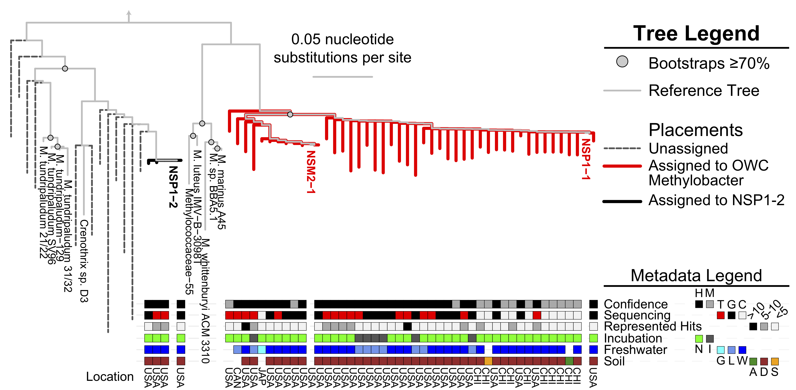

# Published
Figures created using R (at least in part, typically touched up) compiled here

#

Universal activity-based labeling method for ammonia- and alkane-oxidizing bacteria

(https://www.nature.com/articles/s41396-021-01144-0#Sec14)

**ISME fig 8**

legend

**ISME fig 9**

legend

**ISME fig S2**

legend

**ISME fig S3**

legend

#

Microbial Contributions to Carbon, Nitrogen, and Greenhouse Gas Cycling in Freshwater Terrestrial-Aquatic Interfaces

(https://www.proquest.com/intermediateredirectforezproxy)

  *Images in the Thesis folder only included if not another folder, those labelled with a "x" have components or data currently under review

**Thesis fig 2**

legend

**Thesis fig 17**

legend

**Thesis fig 18**

legend

**Thesis fig 19**

legend

**Thesis fig 20**

legend

**Thesis fig 22**

legend

**Thesis fig 26**

legend

**Thesis fig 27**

legend

**Thesis fig 32**

legend

**Thesis fig 37**

legend

#

Metagenomic Approaches Unearth Methanotroph Phylogenetic and Metabolic Diversity 

(https://www.caister.com/cimb/v/v33/57.pdf)

 -data and code originally published here: https://github.com/TheWrightonLab/Methanotroph_rpS3Analyses_SmithWrighton2018
 
 *Images with an "u" have been slighlty modified to match the version in my thesis

**CIMB fig 3**

legend

**CIMB fig 4**

legend

**CIMB fig 5**

legend

#

Members of the Genus Methylobacter Are Inferred To Account for the Majority of Aerobic Methane Oxidation in Oxic Soils from a Freshwater Wetland

(https://journals.asm.org/doi/10.1128/mBio.00815-18)
 
**mBio fig 1**

legend

**mBio fig 2**

legend

**mBio fig 3**

legend

**mBio fig 4**

legend

**mBio fig 5**

legend

**mBio fig S1**

legend

**mBio fig S6**

legend

**mBio fig S7**

legend

